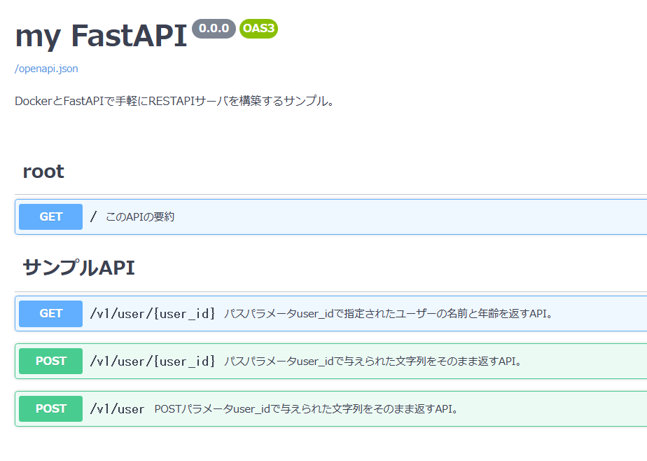
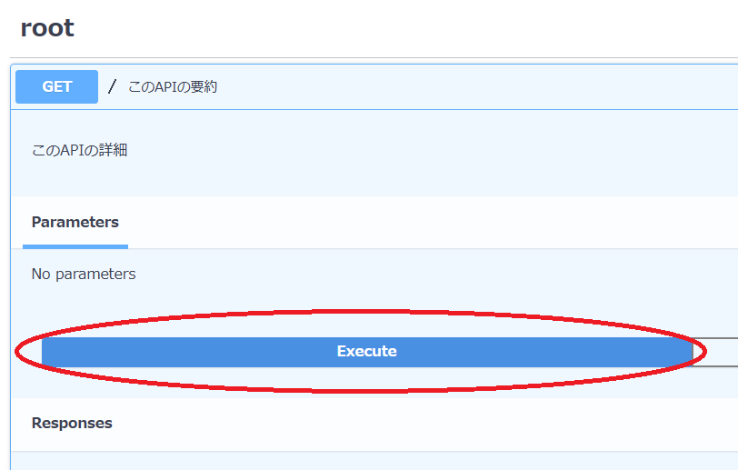
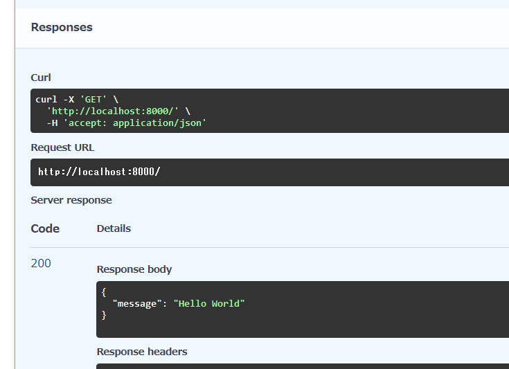
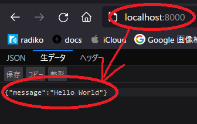

# myfastapi

FastAPIをDockerで実行するテンプレート一式です。
<br />
PythonとFastAPIを使ったRESTAPIサーバがすぐに試せます。
<br />
また、pytestを使ってAPIのテストコードをDockerで実行するサンプルも付いています。

<br />

## 実行環境

Windows, Mac, Linux などに Docker + docker-composeとGitをインストールしてください。

--------

### Windows10

WSL2でUbuntuなどのLinux仮想環境を作って、そこにDocker + docker-composeをインストールするのがおすすめです。

* マイクロソフト WSLの公式マニュアル https://docs.microsoft.com/ja-jp/windows/wsl/

* WSL2 Ubuntu 20.04 にDocker, docker-composeを入れる
https://qiita.com/yagrush/items/f12563eef6a1dd77cd4d

--------

### Mac

Docker Desktopなどをインストールしてください。

https://www.docker.com/

<br />

## FastAPI Dockerコンテナの起動

### WindowsでWSL2を使用する場合

まず、スタートメニューなどから「Ubuntu 20.04 on Windows」などをクリックしてWSL2を起動してください。
<br />
WSL2内のLinuxシェル画面が起動したら、それを使ってこの後の作業を続けてください。

<br />

### この一式を、Gitを使ってダウンロードします

```
git clone https://github.com/yagrush/myfastapi.git
```

<br />

### ディレクトリの中に入ります

```
cd myfastapi
```

<br />

### FastAPIコンテナを起動しましょう


```
docker-compose up --build -d
```

<br />

### APIドキュメントにアクセスしてみます

ブラウザで↓を開きます。<br />
http://localhost:8000/docs<br />
* FastAPIは自動的にAPIドキュメントを生成してくれます。<br />
ここからAPIを実際に実行することも可能です。



<br />

### APIをためしに実行してみます

* root<br />
GET `/`<br/>
を実行してみましょう。<br />
これはURLでいうところの http://localhost:8000/ です。


 ↓<br />



 ↓<br />


<br />
このAPIは、固定のJSON

```
{
  "message": "Hello World"
}
```

を返すAPIですが、その通りちゃんと返ってきたようです。

<br />

### ためしに、ブラウザからもアクセスしてみます

↓をブラウザで開きます。<br />

http://localhost:8000/<br />

↓<br />



<br />

無事、

```
{
  "message": "Hello World"
}
```

が返ってきました。

<br />

## FastAPI Dockerコンテナの終了

`docker-compose.yml`があるディレクトリで↓のコマンドを実行します。

```
docker-compose down
```

<br />

## pytestをDockerで実行する

pytestは、ソースコードの健全性をテストするソースコードを実行するプログラムです。<br />
これもDockerコンテナとして実行してみましょう。<br />
そうすれば、手元のMacやWindowsやWSLにPythonやpytestをインストールする必要が無くなります。<br />
今回は、Dockerとpytest設定ファイルをご用意してありますので、

* pytest-docker-compose.yml
* pytest.Dockerfile
* src/pytest.ini

早速実行してみましょう。<br />
実行すると、`src/pytest.ini` に書いてある通りにテストコードを探して自動的に実行してくれます。<br />
<br />
今回のプロジェクトには、テストコード `src/tests/api/v1/test_user.py` があります。<br />
内容は、API `/v1/user/abcde` を実行して、期待通りのレスポンス

```
{
  "user_name": "abcde 一郎さん",
  "age": 12
}
```

が返ってくるかどうかをチェックします。

```
from fastapi.testclient import TestClient
from prog import app

client = TestClient(app, base_url="http://localhost:8100")


def test_get():
    user_id = "abcde"
    res = client.get(f"/v1/user/{user_id}")
    assert res.status_code == 200
    assert res.json()["user_name"] == f"{user_id} 一郎さん"
    assert res.json()["age"] == 12
```

`pytest`Dockerコンテナを起動します。

```
$ docker-compose -f  pytest-docker-compose.yml up
```
（このコンテナは、pytestが完了次第終了します。）

↓ このように表示されればOKです。

```
WARNING: Found orphan containers (myfastapi) for this project. If you removed or renamed this service in your compose file, you can run this command with the --remove-orphans flag to clean it up.
Starting myfastapi-pytest ... done
Attaching to myfastapi-pytest
myfastapi-pytest | ============================= test session starts ==============================
myfastapi-pytest | platform linux -- Python 3.10.4, pytest-7.1.1, pluggy-1.0.0 -- /usr/local/bin/python
myfastapi-pytest | cachedir: .pytest_cache
myfastapi-pytest | rootdir: /src, configfile: pytest.ini, testpaths: ./tests
myfastapi-pytest | plugins: anyio-3.5.0
myfastapi-pytest | collecting ... collected 1 item
myfastapi-pytest |
myfastapi-pytest | tests/api/v1/test_user.py::test_get API:v1/user/abcde 所要時間：0.0003070831298828125秒
myfastapi-pytest | PASSED
myfastapi-pytest |
myfastapi-pytest | ============================== 1 passed in 0.15s ===============================
myfastapi-pytest exited with code 0
```
